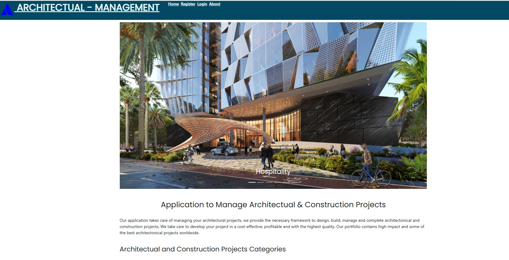
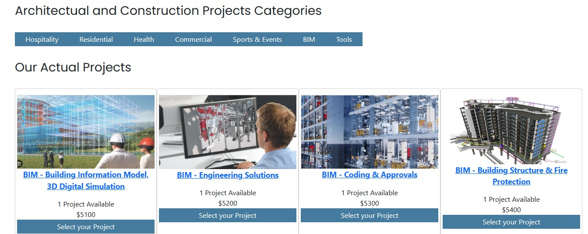
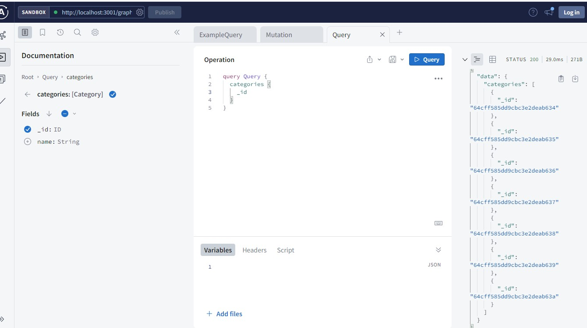

# MAUGB-Final-Project-MERN-Full-Stack-Application
Coding Boot Camp Final Project MERN Full Stack App

# Project Name
Application to manage large Architectural design and Construction projects.

## Project Summary
This is a professional architectural and construction management application.
Platform was build using MERN full stack-up development.   
Create a single page application using MERN to manage architectural and construction projects
Manage multiple projects, track activities, milestones, and priorities.
The construction industry needs to manage specialized projects; this application allows to manage large Architectural design and Construction projects. Allow customers to enter and manage multiple design and construction projects in their portfolio, projects can be updated on progress according to the architectural design and technical requirements. The app allows customers to monitor the progress of the project. Review and comment project updates. Provides a recommendation of specialized tools, equipment, or construction standards to be followed. Manage open vs closed activities for each phase of the project.
Construction industry needs to manage specialized architectural projects; Project portfolio can be very extensive, and projects are complex requiring a web platform to manage them in efficient and effective way; this industry is growing every year and there is a need to improve productivity, cost, quality, and accuracy to manage activities and costs for each project.

Provide an intuitive platform to manage portfolio of projects. Improve productivity and accurate management.
This application provides a platform to manage large Architectural design and Construction projects; allowing customers to enter and manage multiple design and construction projects in their portfolio which contributes to increase productivity, quality and reducing costs.
Project activities and approvals can be updated easily according to the architectural design and technical requirements. 
An additional feature is to provide a list specialized tools and services that can be purchased using the  e-commerce section of the app.

## Table of Contents (Optional)

If your README is long, add a table of contents to make it easy for users to find what they need.

- [Installation](#installation)
- [Usage](#usage)
- [Developers](#developers)
- [Technologies](#technologies)
- [Credits](#credits)
- [License](#license)
- [Features](#features)
- [Contact](#contact)

## Installation

- Clone our repo to your computer

## Usage

Provide instructions and examples for use. Include screenshots as needed.

Main Page Architectural Management App

## Developers

Mauricio Gomez

## Technologies: 

Thechnologies used for this application: Full Tech Stack  MERN application

Front End:
- React.JS
- GraphQL
- Apollo Client
- JavaScript
- ES6
- API
- CSS
- HTML
- BootStrap

  Back End:
  - Node.Js
  - Express.Js
  - MongoDB
  - Mongoose ODM
  - (JWT) Authentication

- What libraries are used: 

- Other: 
- Heroku Deployment
- GitHub
   
## Credits
-	Generate license badge: https://shields.io/ .  
-	Brandon Gatlin.  Coding Bootcamp Instructor
-	Bradley Boyd. Coding Bootcamp Instructor
-	Use of NodeJS  
-	 Use of JavaScript
-	Use of React
-	Use of ReactDom
-	Use of CSS
-	Use of bootstrap
-	Use of React Bootstrap
-	Mongo DB
-	Express JS
-	MongoDB
-	GraphQL
-	Apollo server express
-	GitHub

## License

This program runs under the MIT license.
    MIT
    
  

## Features

-	Single-page application to manage Architectural projects.
-	Navigation section for Login, Signup, Shopping Cart, feedback.
-	Sort of projects by categories.
-	Display information for each project.
-	Shopping cart section.
-	Section for contact and message.
-	Validation of e-mail.

## How to Contribute

If you would like to contribute please send an e-mail to gomezb_mauricio@hotmail.com. Please share your GitHub repository name and your message.

## Animated Gifs/Pictures of App

- Place various screens of your app here after they have been built

## MVP (Minimum Viable Product)
- Customer manage and sort multiple projects by category manage each of them
- Enter technical requirements per project
- Add, Retrieve, Update , Delete or Read activities per project
- List of suggested equipment to be used
- Client: user interacting with Application. Web Browser and Mobile Browser.
- Front End Application using React
- Sign-up and Log-in section, password and e-mail validation
- Customer Support section
- Shopping section Platform

## Stretch Goals
- Requirements database historical data from previous projects
- Handling drawings
- Technical reviews vs requirements
- Off-line functionality
- Shows status per activity

## Future Development
Timing indicates critical path, priorities, and risk management.
Individual activity tracking is like a resource and email notifications.
Visual tracking of progress of the project.
Integrate application with another platforms.
Project cost tracking with calculations managed by the database and accurate report per project.

## Contact

gomezb_mauricio@hotmail.com
https://github.com/MauricioGB1

